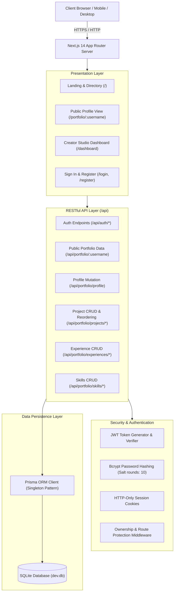
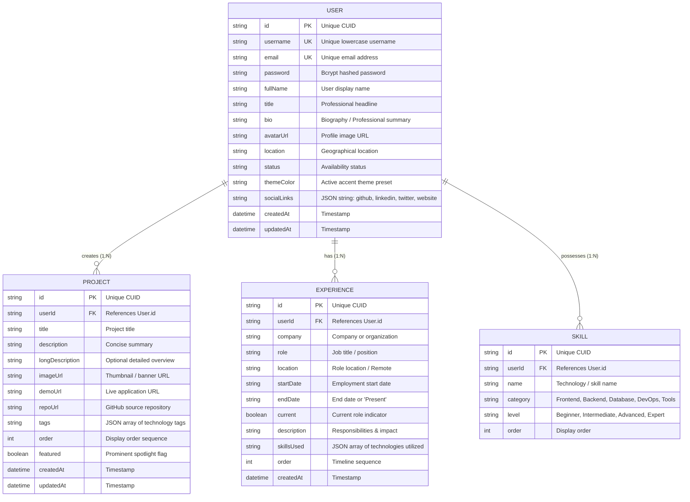

# FolioCraft — Portfolio Management System Ecosystem
### EncoderX Remote Internship Batch 02 | Full Stack Development — Week 03 (Task 3)

[](https://nextjs.org/)
[](https://www.typescriptlang.org/)
[](https://tailwindcss.com/)
[](https://www.prisma.io/)
[](https://www.sqlite.org/)

---

## 📌 Executive Summary

**FolioCraft** is a dynamic, multi-tenant **Portfolio Management System** engineered to provide software professionals and creatives with an adaptive platform to build, manage, customize, and showcase their professional credentials, engineering projects, career milestones, and skill proficiencies.

The application features:
1. **Dynamic Username Routing**: Every creator receives a customized, public URL at `/portfolio/:username` (e.g., `/portfolio/johndoe`).
2. **Creator Studio Dashboard**: A protected administration panel (`/dashboard`) allowing creators to manage their profile, perform full CRUD operations on projects, reorder portfolio cards, manage employment history, and categorize technical skills.
3. **Dynamic Accent Theme Engine**: Real-time theme customization supporting 6 vibrant presets (*Neon Cyan*, *Electric Violet*, *Aurora Emerald*, *Sunset Amber*, *Rose Quartz*, and *Cyber Indigo*) that adapt across hero banners, glow effects, tags, and interactive buttons.
4. **Structured RESTful API**: Production-grade endpoints (`/api/portfolio/...`, `/api/auth/...`) with input validation, JWT cookie authentication, and robust security headers.
5. **Zero-Config Database Persistence**: Self-contained SQLite relational database powered by Prisma ORM, pre-seeded with sample creator portfolios.

---

## 🏗 System Architecture & Design Patterns

The architecture follows modern full-stack engineering standards leveraging Next.js App Router:



### Design Patterns Used
* **MVC & Modular Routing**: Clear separation between API route handlers (Controllers), Prisma ORM schemas (Models), and React Client/Server components (Views).
* **Singleton Pattern**: Database connection pooling implemented in `src/lib/prisma.ts` to prevent multiple Prisma client instances during hot-reloads.
* **Component-Driven UI**: Reusable navigation bars, footers, glassmorphic cards, timeline badges, and modal dialogs.
* **Stateless Token Authentication**: HTTP-Only cookie-based JWT sessions combined with bcrypt password encryption.

---

## 🗄 Database Structure & Entity Relationships (ERD)



---

## 🚀 RESTful API Request & Response Specifications

### 1. Authentication Endpoints

#### `POST /api/auth/register`
* **Description**: Registers a new creator and sets an HTTP-only JWT cookie.
* **Request Body**:
```json
{
  "username": "alexdev",
  "email": "alex@example.com",
  "password": "password123",
  "fullName": "Alex Henderson"
}
```
* **Response (201 Created)**:
```json
{
  "message": "Account registered successfully.",
  "user": {
    "id": "cuid...",
    "username": "alexdev",
    "email": "alex@example.com",
    "fullName": "Alex Henderson",
    "title": "Full Stack Developer",
    "themeColor": "indigo"
  }
}
```

#### `POST /api/auth/login`
* **Description**: Authenticates existing creator and returns user details.
* **Request Body**:
```json
{
  "login": "johndoe",
  "password": "password123"
}
```
* **Response (200 OK)**:
```json
{
  "message": "Logged in successfully.",
  "user": {
    "username": "johndoe",
    "fullName": "Johnathan Doe",
    "themeColor": "cyan"
  }
}
```

#### `GET /api/auth/me`
* **Description**: Verifies session token and retrieves authenticated user object.

#### `POST /api/auth/logout`
* **Description**: Clears the `auth_token` cookie.

---

### 2. Portfolio Endpoints

#### `GET /api/portfolio/:username`
* **Description**: **Core Public Endpoint**. Fetches complete portfolio payload by unique username.
* **Response (200 OK)**:
```json
{
  "user": {
    "username": "johndoe",
    "fullName": "Johnathan Doe",
    "title": "Senior Full Stack & Cloud Architect",
    "bio": "Crafting mission-critical web applications...",
    "avatarUrl": "https://images.unsplash.com/...",
    "themeColor": "cyan",
    "socialLinks": {
      "github": "https://github.com/johndoe",
      "linkedin": "https://linkedin.com/in/johndoe"
    }
  },
  "projects": [
    {
      "id": "cuid1",
      "title": "CloudFlow - Serverless Workflow Orchestrator",
      "description": "High-throughput DAG workflow execution engine...",
      "imageUrl": "https://images.unsplash.com/...",
      "demoUrl": "https://cloudflow-demo.vercel.app",
      "repoUrl": "https://github.com/johndoe/cloudflow",
      "tags": ["Next.js", "TypeScript", "Redis"],
      "featured": true,
      "order": 1
    }
  ],
  "experiences": [
    {
      "company": "TechNova Labs",
      "role": "Lead Full Stack Architect",
      "startDate": "Jan 2023",
      "endDate": "Present",
      "current": true,
      "skillsUsed": ["Next.js", "AWS", "Docker"]
    }
  ],
  "skills": [
    { "name": "React / Next.js", "category": "Frontend", "level": "Expert" },
    { "name": "Node.js & Express", "category": "Backend", "level": "Expert" }
  ]
}
```

#### `PUT /api/portfolio/profile`
* **Description**: Updates profile details, biography, social links, and theme color.
* **Authentication**: Required (HTTP-only cookie or `Authorization: Bearer <token>`).
* **Request Body**:
```json
{
  "fullName": "Johnathan Doe",
  "title": "Lead Software Architect",
  "bio": "Updated bio text...",
  "themeColor": "cyan",
  "socialLinks": {
    "github": "https://github.com/johndoe",
    "linkedin": "https://linkedin.com/in/johndoe"
  }
}
```

#### `POST /api/portfolio/projects`
* **Description**: Adds a new project to the creator's portfolio.
* **Authentication**: Required.
* **Request Body**:
```json
{
  "title": "NexusAI Collaborative Canvas",
  "description": "Infinite vector canvas with AI copilot",
  "imageUrl": "https://...",
  "demoUrl": "https://...",
  "repoUrl": "https://github.com/...",
  "tags": ["React", "WebSockets", "TailwindCSS"],
  "featured": true
}
```

#### `PUT /api/portfolio/projects/reorder`
* **Description**: Updates order sequence of projects for live display.
* **Request Body**:
```json
{
  "items": [
    { "id": "proj_1", "order": 1 },
    { "id": "proj_2", "order": 2 }
  ]
}
```

---

## 🔒 Authentication & Security Implementation

1. **Password Security**:
   - Passwords are encrypted before database insertion using `bcryptjs` with 10 salt rounds.
   - Plaintext passwords are never stored or returned in any API response.
2. **Session Handling**:
   - Signed JSON Web Tokens (JWT) using `jsonwebtoken` signed with a secure secret key (`JWT_SECRET`).
   - Token is delivered to the browser via an **`httpOnly` cookie** with `SameSite: Lax` to mitigate Cross-Site Scripting (XSS) and CSRF vulnerabilities.
3. **Data Ownership & Isolation**:
   - Every mutation route (`PUT /projects/:id`, `DELETE /projects/:id`, `PUT /profile`, etc.) verifies that the authenticated `userId` matches the resource's owner before executing changes.
   - Unauthorized attempts return `401 Unauthorized` or `403 Forbidden`.

---

## 💻 Local Setup & Execution Guide

### Prerequisites
* Node.js **v18.0.0+** or **v20+** (tested on Node v25.2.1)
* NPM **v9+** or **v10+**

### Step 1: Clone or Open Workspace
```bash
cd "e:/ongoing projects/portfolio management"
```

### Step 2: Install Dependencies
```bash
npm install
```

### Step 3: Initialize & Seed Database
```bash
# Push Prisma schema to SQLite dev.db and generate client
npx prisma db push

# Seed sample creator accounts (johndoe, sarahdev)
node prisma/seed.js
```

### Step 4: Run the Development Server
```bash
npm run dev
```

Open [http://localhost:3000](http://localhost:3000) in your browser.

---

## 🔑 Demo Credentials (Ready Out-Of-The-Box)

The database comes pre-seeded with two accounts for instant testing:

| Username | Email | Password | Theme | Specialization |
| :--- | :--- | :--- | :--- | :--- |
| **`johndoe`** | `john@encoderx.dev` | `password123` | **Neon Cyan** | Senior Full Stack & Cloud Architect |
| **`sarahdev`** | `sarah@encoderx.dev` | `password123` | **Electric Violet** | UI/UX Designer & Creative Frontend |

* You can also register a brand-new user at `/register` to test fresh creator onboarding!

---

## 🌐 Public Routes Quick Reference

* **Landing Page**: `http://localhost:3000/`
* **John Doe's Public Portfolio**: `http://localhost:3000/portfolio/johndoe`
* **Sarah Connor's Public Portfolio**: `http://localhost:3000/portfolio/sarahdev`
* **Creator Dashboard**: `http://localhost:3000/dashboard`
* **Sign In Page**: `http://localhost:3000/login`
* **Registration Page**: `http://localhost:3000/register`

---

## 🚢 Deployment & Self-Hosting Guide

### Option 1: Vercel (Recommended for Next.js)
1. Push the codebase to a GitHub repository.
2. Link the repository to [Vercel](https://vercel.com).
3. Set Environment Variables:
   - `JWT_SECRET`: `your_random_production_secret_key`
   - `DATABASE_URL`: `file:./dev.db` (or link to a cloud PostgreSQL/Supabase database by updating `provider = "postgresql"` in `prisma/schema.prisma`).
4. Vercel automatically runs `npm run build` and deploys.

### Option 2: Docker Containerization
A standard `Dockerfile` for self-hosting on VPS, Render, or Railway:

```dockerfile
FROM node:20-alpine AS builder
WORKDIR /app
COPY package*.json ./
RUN npm ci
COPY . .
RUN npx prisma generate
RUN npm run build

FROM node:20-alpine AS runner
WORKDIR /app
ENV NODE_ENV=production
COPY --from=builder /app/public ./public
COPY --from=builder /app/.next ./.next
COPY --from=builder /app/node_modules ./node_modules
COPY --from=builder /app/package.json ./package.json
COPY --from=builder /app/prisma ./prisma
EXPOSE 3000
CMD ["npm", "run", "start"]
```

---

## 📹 Project Demonstration Video Outline (3–5 Min)

* **Minute 00:00 - 01:00**: Introduction & Architecture overview (EncoderX Batch 02 Task 3, Next.js App Router, SQLite & Prisma).
* **Minute 01:00 - 02:15**: Public Profile Showcase (`/portfolio/johndoe`) — dynamic routing, responsive design, project filtering, and theme styling.
* **Minute 02:15 - 03:45**: Creator Dashboard Walkthrough — editing bio, adding a project, reordering cards, and switching the theme palette to Neon Cyan in real-time.
* **Minute 03:45 - 04:30**: REST API demonstration (`GET /api/portfolio/:username`) and database schema explanation.
* **Minute 04:30 - 05:00**: Submission checklist and conclusion.

---

## 📋 EncoderX Submission Checklist

- [x] System architecture planned & modularized.
- [x] Relational database structure created (SQLite + Prisma).
- [x] User, Project, Experience, and Skill models implemented.
- [x] Structured RESTful API endpoints created and verified.
- [x] Dynamic username routing (`/portfolio/:username`) implemented.
- [x] Creator dashboard completed with full CRUD & reordering.
- [x] Public portfolio profile view completed with responsive styling.
- [x] Dynamic theme engine implemented (6 presets).
- [x] Forms connected with database operations.
- [x] Input validation & unauthorized update prevention implemented.
- [x] Comprehensive technical documentation completed in `README.md`.
- [x] Local setup instructions & sample credentials provided.

---

### EncoderX Remote Internship Batch 02
**Track**: Full Stack Development  
**Week**: 03  
**Task**: 3 — Portfolio Management System  
✉ `encoderxtech@gmail.com`
